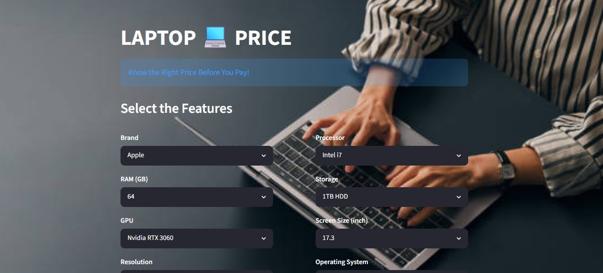
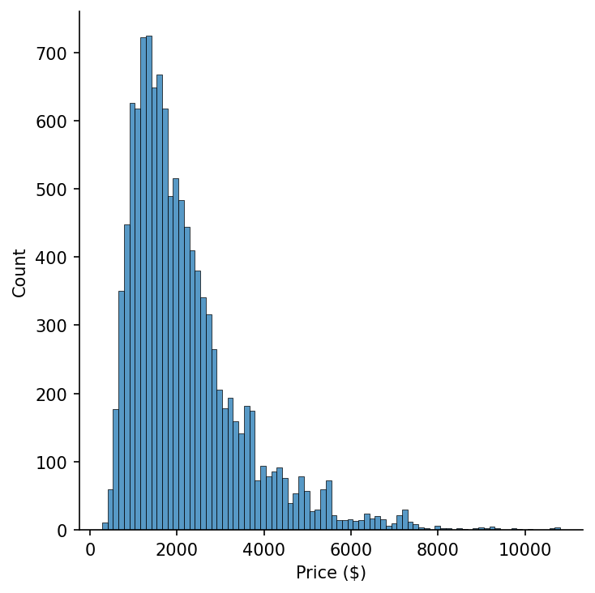
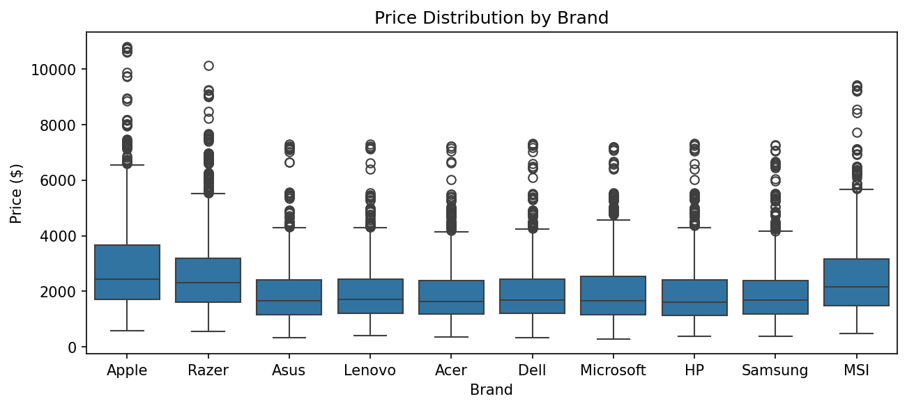
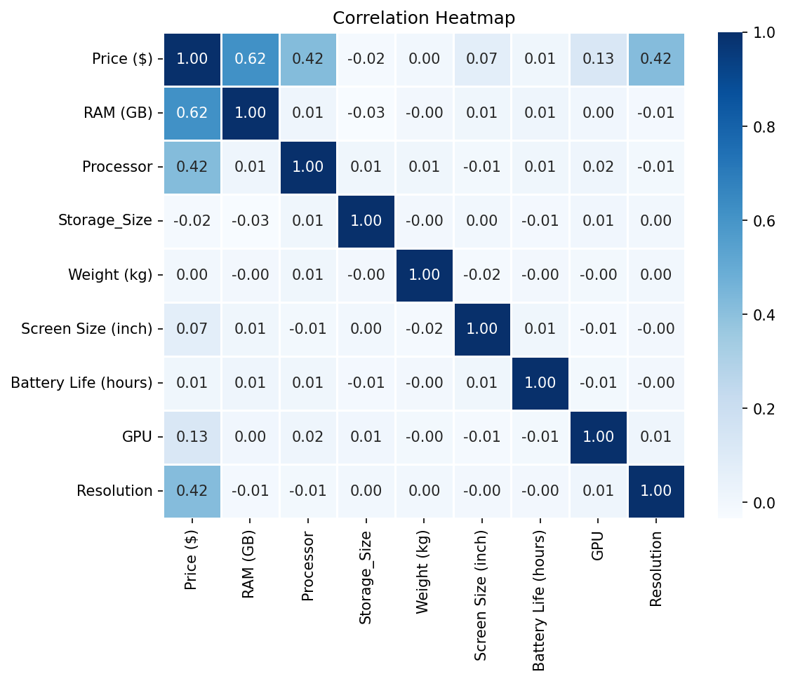
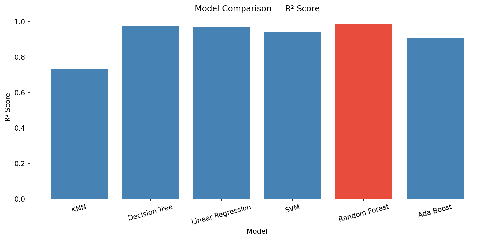

# 💻 Laptop Price Predictor

A machine learning web application that predicts laptop prices based on hardware specifications such as brand, processor, RAM, GPU, and storage. Built with Python and deployed as an interactive web app using Streamlit.

---

## 📸 Screenshots

### Input Interface


### Prediction Result


---

## 📌 Project Overview

Laptop prices vary widely and are often confusing for buyers. This app helps users estimate a fair market price based on their desired specifications, using a machine learning model trained on real laptop data.

The project covers the **complete machine learning pipeline** — from raw data to a deployed, interactive web application.

---

## 🧠 What I Built & Why

| Stage | What I Did |
|-------|-----------|
| Data Preprocessing | Cleaned missing values, handled categorical and numerical features |
| Exploratory Data Analysis | Visualized price distributions, brand-wise pricing, and feature correlations |
| Feature Engineering | Built a custom `DataTransformer` class using OOP for reusable preprocessing |
| Encoding | Applied OneHotEncoding for Brand and Operating System columns |
| Scaling | Used MinMaxScaler on numerical features (fit only on training data to avoid data leakage) |
| Model Building | Trained and compared 6 different ML models |
| Hyperparameter Tuning | Used GridSearchCV and RandomizedSearchCV to optimize the best model |
| Model Optimization | Compressed the final model using `joblib` for efficient deployment |
| Deployment | Built an interactive Streamlit web app with a clean, custom-styled UI |

---

## ⚙️ Tech Stack

**Language:** Python

**Libraries:**
- Pandas, NumPy — data manipulation
- Matplotlib, Seaborn — data visualization
- Scikit-learn — machine learning models, encoding, scaling, evaluation
- Streamlit — web app deployment
- Joblib — model serialization and compression

---

## 📊 Data Analysis

### Price Distribution


### Price Distribution by Brand


### Feature Correlation Heatmap


---

## 📈 Model Comparison

Six regression models were trained and evaluated on the test set using R² score:

| Model | R² Score |
|-------|----------|
| KNN | 0.7538 |
| Decision Tree | 0.9738 |
| Linear Regression | 0.9696 |
| SVM | 0.9419 |
| ✅ **Random Forest** | **0.9860** |
| AdaBoost | 0.9015 |



**Random Forest** was selected as the final model, achieving:
- **R² Score:** 0.9860 — explains 98.6% of the variance in laptop prices
- **MAE:** $109.34 — average prediction error of roughly $109

---

## 🗂️ Project Structure

```
laptop-price-predictor/
│
├── app.py                        # Streamlit web application
├── requirements.txt              # Python dependencies
├── .gitignore
│
├── utils/
│   ├── __init__.py
│   └── data_transformer.py       # Custom OOP preprocessing class
│
├── notebook/
│   └── laptop_price_analysis.ipynb   # Full EDA, preprocessing & model building
│
├── artifacts/
│   ├── rfmodel.sav                # Trained Random Forest model
│   ├── rfscaler.sav               # Fitted MinMaxScaler
│   ├── Brand.sav                  # OneHotEncoder for Brand
│   ├── Operating_System.sav      # OneHotEncoder for Operating System
│   └── DataTransformer.sav       # Saved preprocessing transformer
│
├── data/
│   └── laptop_prices.csv          # Dataset
│
└── assets/
    ├── background.jpg
    ├── app_overview.jpeg
    ├── app_prediction.jpeg
    ├── price_distribution.png
    ├── price_by_brand.png
    ├── correlation_heatmap.png
    └── model_comparison.png
```

---

## 🔧 Getting Started

### 1. Clone the repository
```bash
git clone https://github.com/Hannah-Shafeeque/laptop-price-predictor.git
cd laptop-price-predictor
```

### 2. Install dependencies
```bash
pip install -r requirements.txt
```

### 3. Run the app
```bash
streamlit run app.py
```

The app will open in your browser at `http://localhost:8501`

---

## 💡 Key Learnings

- Built a **custom preprocessing class** using Python OOP principles, making the pipeline modular and reusable
- Learned to fit scalers **only on training data** to prevent data leakage and ensure honest evaluation
- Compared **6 regression models** systematically using R² and MAE rather than assuming one model would perform best
- Used **GridSearchCV and RandomizedSearchCV** for hyperparameter tuning to extract the best performance from the final model
- Reduced the trained model size from 82MB to ~9MB using **joblib compression**, making it lightweight enough for GitHub and Streamlit deployment
- Gained hands-on experience with the full lifecycle of an ML project — from raw data to a deployed, user-facing product

---

## 👩‍💻 Author

**Hannah Shafeeque**
Mathematics Graduate | Data Science & AI/ML Engineer
Kerala, India

[](https://www.linkedin.com/in/hannah-shafeeque/)
[](https://github.com/Hannah-Shafeeque)
